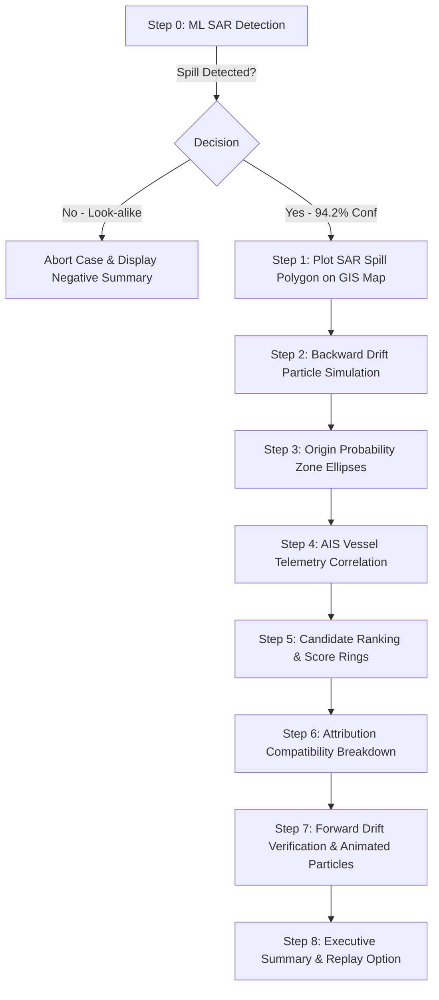

# 🌊 MariTrace (SpillTrace) — Project Overview & Architecture Guide

> **Maritime Oil Spill Detection, Backward Drift Reconstruction & AIS Vessel Attribution Platform**

---

## 📌 Executive Summary

**MariTrace** (codebase package `spilltrace`) is an advanced maritime forensic dashboard and decision-support system. It bridges satellite Earth observation (**Sentinel-1 Synthetic Aperture Radar / SAR**), **metocean hydrodynamic drift modeling** (wind vectors and ocean currents), and **AIS (Automatic Identification System) vessel telemetry** to identify, track, and attribute maritime oil spills to probable source vessels with quantifiable confidence scores.

The platform provides a guided **9-step investigation workflow** (Steps 0–8), complete with an interactive 3D planetary globe that seamlessly transitions into a 2D GIS maritime map powered by **MapLibre GL JS** and **Turf.js**.

---

## 🗂️ Complete Directory & File Structure

```text
d:\sih\
├── index.html                           # Main application HTML, UI layout, header, map, tabs & CDN imports
├── package.json                         # Project metadata, scripts, and runtime dependencies
├── package-lock.json                    # Locked dependency tree
├── vite.config.js                       # Vite dev server and build configuration (Port 3000)
├── dist/                                # Production build bundle output
├── public/                              # Static public assets
│   ├── avatar.jpg                       # MariTrace header brand avatar / logo
│   ├── avatar.png                       # Alternate brand logo
│   └── assets/
│       └── sar-placeholder.png          # Realistic Sentinel-1 SAR sample imagery for ML inference
└── src/
    ├── main.js                          # Application entry point: initializes map, globe, event listeners & tabs
    │
    ├── data/
    │   └── case001.ts                   # Comprehensive benchmark dataset: spill geometry, origin, 7 vessels, wind/currents
    │
    ├── engine/
    │   └── investigation-workflow.js    # Core state machine orchestrating the 9-stage investigation pipeline & replay
    │
    ├── map/
    │   ├── map-init.js                  # MapLibre GL JS setup (raster tile basemap, camera controls, flyTo)
    │   └── layers/
    │       ├── animated-particles-layer.ts # Canvas/GeoJSON particle animation engine for forward drift dispersion
    │       ├── comparison-layer.js      # Dual-polygon overlay comparing observed vs. simulated slick with overlap badge
    │       ├── drift-layer.js           # LineString layers with directional arrows for backward & forward drift trajectories
    │       ├── heatmap-layer.js         # Multi-ring concentric probability ellipses (Turf.js) for spill origin zone
    │       ├── spill-layer.js           # SAR detected oil slick polygon with interactive popup
    │       ├── vessel-layer.js          # AIS vessel point markers, heading vectors, color coding, and route trajectories
    │       └── wind-current-layer.js    # Metocean vector field visualization (wind & ocean current arrows and speed)
    │
    ├── panels/
    │   ├── candidate-list-panel.js      # Ranked vessel list, candidate cards, and deep-dive evidence breakdown view
    │   ├── drift-info-panel.js          # Telemetry panel displaying estimated spill time window and origin bounding box
    │   ├── drift-verification-panel.ts  # Forward drift verification controller with Play/Pause/Reset animation buttons
    │   ├── ml-detection-panel.ts        # Interactive ML SAR analysis panel (dual-image selector, scanning spinner, results)
    │   ├── spill-info-panel.js          # SAR detection metadata panel (timestamp, detected area km², confidence)
    │   ├── summary-panel.js             # Final investigation verdict & report with metric breakdown and replay action
    │   └── timeline-panel.js            # Connected vertical investigation timeline tracker (8 milestone stages)
    │
    ├── styles/
    │   ├── variables.css                # Global design tokens (HSL color system, fonts, elevation shadows, borders)
    │   ├── base.css                     # Reset, typography (Inter, JetBrains Mono), scrollbars, and body styling
    │   ├── layout.css                   # Grid layout for header, main split view (map + side panel), and footer
    │   ├── components.css               # Buttons, cards, badges, SVG progress rings, and data grids
    │   ├── map.css                      # MapLibre container overrides, custom dark popups, controls, and legends
    │   ├── animations.css               # Keyframe animations (pulse, fade-in, shimmer, score ring transitions)
    │   └── ml-panel.css                 # Dedicated styles for ML image scanner, radar crosshairs, and progress bar
    │
    └── utils/
        ├── animation-utils.js           # Easing math, sequential steps runner, and SVG score ring dynamic animators
        ├── format-utils.js              # Formatting helpers for timestamps, speed (knots), heading, area, and badges
        ├── geo-utils.js                 # Haversine distance, bearing, shoelace polygon area, and coordinate formatters
        └── scoring.ts                   # Multi-factor mathematical attribution algorithm and confidence classifier
```

---

## 🚀 Key Features & Capabilities

### 1. 🌍 Hybrid 3D Planetary to 2D GIS Navigation
- **3D Interactive Globe (`globe.gl` / Three.js)**: Starts with a high-resolution 3D planetary view with night-sky background, topography bump mapping, and auto-rotation.
- **Cinematic Transition**: Upon initiating the investigation, the camera flies smoothly into the precise geographic coordinates of the Arabian Sea spill location, cross-fading into the 2D GIS view.
- **MapLibre GL Maritime Basemap**: High-performance raster basemap with zoom, navigation, compass, scale, and custom attribution.

### 2. 🧠 Sentinel-1 SAR Machine Learning Detection (Step 0)
- **Interactive Dual-Image Analysis**:
  - **Image A (Arabian Sea)**: True positive oil slick exhibiting radar backscatter dampening.
  - **Image B (Coastal Region)**: False positive / look-alike (natural biogenic film or wind-shadow).
- **Simulated Inference Pipeline**: Step-by-step radar preprocessing, pixel segmentation, thresholding, and polygon feature extraction.
- **Look-Alike Rejection Logic**: If Image B is tested, the system flags `28.4% confidence (Look-alike)` and safely aborts the case to conserve computational resources. If Image A is tested, it outputs `94.2% confidence` with an estimated `14.8 km²` slick area.

### 3. ⏪ Backward Drift Reconstruction (Steps 1–3)
- **Lagrangian Particle Backtracking**: Reconstructs where the oil slick originated by modeling environmental forcing backwards in time.
- **Metocean Vector Integration**: Displays real-time wind vectors (knots and meteorological bearing) and sea surface current vectors.
- **Probabilistic Origin Zone Generation**: Uses `@turf/turf` to construct concentric elliptical confidence zones (90%, 50%, 10% probability) defining the spatiotemporal origin window.

### 4. 🚢 AIS Vessel Telemetry Correlation & Ranking (Steps 4–5)
- **Historical Trajectory Analysis**: Correlates AIS ship positions against the computed origin zone and temporal release window.
- **7 Simulated Vessels in Benchmark Dataset**:
  - `MV OCEAN STAR` (Oil Tanker, MMSI 636012345) — **Top Suspect** (Direct intersection at origin window).
  - `MV EASTERN WIND` (Cargo, MMSI 636045678) — Moderate distance, temporal mismatch.
  - `MV BLUE HORIZON` (Tanker), `MV CORAL TRADER` (Cargo), `MV SEA FALCON` (Cargo), `MV MERIDIAN` (Tanker), `MV PACIFIC DAWN` (Cargo).
- **Candidate Ranking Board**: Interactive cards displaying rank badges, speed, heading, distance from origin, and SVG circular progress score rings.

### 5. 🧮 Multi-Dimensional Attribution Compatibility Scoring (Step 6)
The engine applies a mathematically weighted multi-factor scoring formula to quantify how closely a vessel's trajectory matches the spill evidence:

$$\text{Overall Score} = \sum (w_i \times S_i)$$

| Dimension | Weight ($w_i$) | Evaluation Metric |
|---|:---:|---|
| **Spatial Compatibility** | **25%** | Proximity of vessel route to origin zone centroid |
| **Temporal Compatibility** | **20%** | Synchronization with estimated release time window |
| **Trajectory Similarity** | **20%** | Directional consistency between vessel track & slick axis |
| **Drift Agreement** | **25%** | Agreement between forward-simulated slick and observed spill |
| **AIS Data Quality** | **10%** | Frequency, continuity, and completeness of AIS pings |

#### Confidence Classification
- **$\ge 80$ / 100**: 🔴 **HIGH Confidence**
- **$50 - 79$ / 100**: 🟡 **MEDIUM Confidence**
- **$< 50$ / 100**: ⚪ **LOW Confidence**

### 6. ⏩ Forward Drift Verification & Animated Particles (Step 7)
- **Drift Simulation Verification**: Releases simulated oil particles from the candidate vessel's track at the time of transit and propels them forward to current observation time.
- **Interactive Particle Layer**: Animated Canvas/GeoJSON particle system using `requestAnimationFrame` with Play, Pause, and Reset controls.
- **Dual Slick Comparison**: Renders the **Observed SAR Slick** (coral solid outline) vs. the **Simulated Forward Slick** (magenta dashed outline) with a real-time **73% Overlap Badge** (Slick Agreement: 94/100).

### 7. 📋 Executive Evidence Summary & Replay (Step 8)
- Comprehensive incident dossier showing Case ID, Spill Area, SAR Detection Confidence, Origin Confidence, and Candidate Tally.
- Detailed culprit breakdown for `MV OCEAN STAR` with evidence checklist.
- Explicit regulatory disclaimer: *"MARITRACE provides an evidence-based compatibility ranking, not a legal determination of responsibility."*
- Full investigation **Replay Engine** that resets all map layers, state models, and animates from the beginning.

### 8. ⌨️ Interactive Presentation Controls
- **Keyboard Stepping**: Presenters can use `Enter`, `Space`, `ArrowRight`, or `PageDown` to advance through each step of the investigation without needing to click.
- **Layer Toggle Switchboard**: Toggle SAR Spill, Origin Probability, Backward Drift, Forward Drift, AIS Vessels, Wind & Currents, and Slick Comparison layers independently.

---

## 🛠️ Technology Stack

| Layer | Technology | Purpose |
|---|---|---|
| **Build & Dev Server** | [Vite 5](https://vitejs.dev/) | Ultra-fast HMR and ESM bundling |
| **Geographic Mapping** | [MapLibre GL JS 4.5](https://maplibre.org/) | Vector & raster map rendering, WebGL GIS layers |
| **3D Planetary View** | [Globe.gl](https://globe.gl/) (Three.js) | Interactive rotating 3D Earth globe |
| **Spatial Analysis** | [@turf/turf 7.1](https://turfjs.org/) | Ellipse generation, centroids, geo-calculations |
| **Core Languages** | Vanilla JavaScript (ES Modules) & TypeScript | Lightweight, fast, dependency-free architecture |
| **Styling** | Modern Vanilla CSS | Glassmorphism, CSS Custom Properties, Dark UI |
| **Testing / QA** | Puppeteer & Node.js scripts | Headless browser testing & screenshot capture |

---

## 🚦 Investigation Pipeline Sequence (Step-by-Step)



---

## 💻 How to Run the Project Locally

### Prerequisites
- [Node.js](https://nodejs.org/) (version 18 or higher recommended)
- `npm` (bundled with Node.js)

### Installation & Execution
```bash
# 1. Install dependencies
npm install

# 2. Start the local Vite development server
npm run dev
```

The application will be available in your browser at:
👉 **`http://localhost:3000`**

### Build for Production
```bash
npm run build
```
This outputs an optimized, standalone production bundle into the `dist/` directory.
