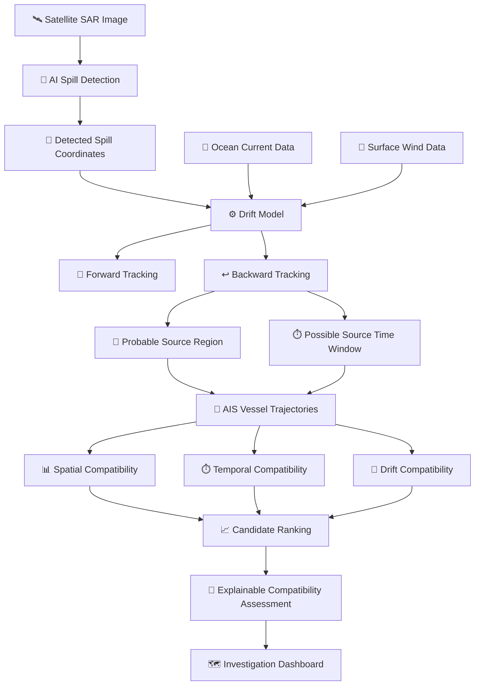
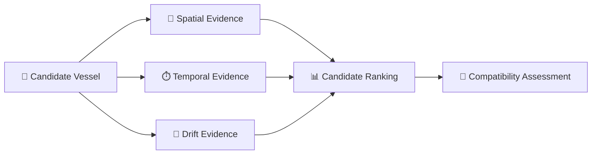
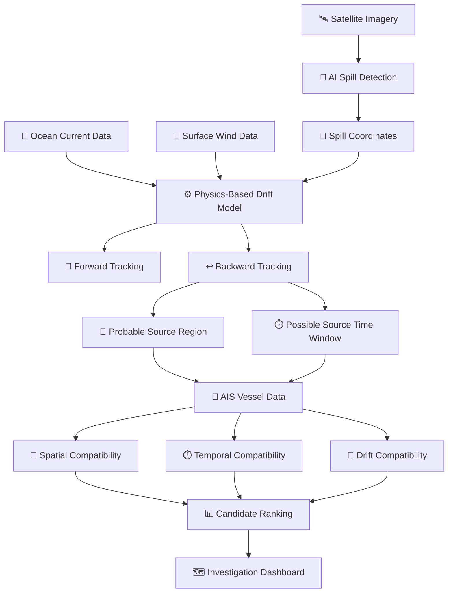

# 🌊 MARITRACE
# 🛰️ AI-POWERED MARITIME OIL SPILL DETECTION & VESSEL CORRELATION SYSTEM

<p align="center">

  
  
  
  
  
  
  
  

</p>

---

<p align="center">

## 🛰️ DETECT THE SPILL • RECONSTRUCT THE SOURCE • CORRELATE THE VESSELS

</p>

<p align="center">
  <b>From satellite observation to explainable maritime intelligence.</b>
</p>

<p align="center">

🌊 Satellite Intelligence  
🧠 AI Detection  
🌊 Physics-Based Drift  
↩️ Source Reconstruction  
🚢 AIS Correlation  
🔎 Explainable Investigation

</p>

---

# 🌐 LIVE PROTOTYPE

<p align="center">

### 🚀 <a href="https://spill-trace.vercel.app/">TRY MARITRACE LIVE</a>

</p>

**Live Prototype:**  
[Click here](https://maritrace-v2-1.vercel.app/)

---

# 📌 TABLE OF CONTENTS

- [🌊 About MARITRACE](#-about-maritrace)
- [🎯 Problem Statement](#-problem-statement)
- [💡 Our Solution](#-our-solution)
- [🔄 End-to-End Workflow](#-end-to-end-workflow)
- [🔬 How MARITRACE Works](#-how-maritrace-works)
- [🛰️ AI Spill Detection](#️-ai-spill-detection)
- [🌊 Physics-Based Drift Modelling](#-physics-based-drift-modelling)
- [🚀 Forward Tracking](#-forward-tracking)
- [↩️ Backward Source Reconstruction](#️-backward-source-reconstruction)
- [🚢 AIS Vessel Correlation](#-ais-vessel-correlation)
- [🧠 Explainable Investigation](#-explainable-investigation)
- [🗺️ Interactive Dashboard](#️-interactive-dashboard)
- [🏗️ System Architecture](#️-system-architecture)
- [📊 Evidence Fusion](#-evidence-fusion)
- [🛠️ Technology Stack](#️-technology-stack)
- [📚 Research Foundation](#-research-foundation)
- [🔬 Physics Foundation](#-physics-foundation)
- [⚠️ Current Limitations](#️-current-limitations)
- [🚀 Future Enhancements](#-future-enhancements)
- [🌱 Impact](#-impact)
- [🎬 Demo](#-demo)
- [📂 Project Structure](#-project-structure)
- [⚙️ Installation](#️-installation)
- [🏆 Smart India Hackathon 2026](#-smart-india-hackathon-2026)
- [👥 Team HACK-OS](#-team-hack-os)
- [📄 License](#-license)

---

# 🌊 ABOUT MARITRACE

**MARITRACE** is an AI-powered maritime intelligence system designed to
investigate oil spills at sea by combining:

- 🛰️ Satellite imagery
- 🧠 AI-based spill detection
- 🌊 Ocean-current information
- 💨 Surface-wind information
- 🚀 Physics-based particle drift modelling
- ↩️ Backward source reconstruction
- 🚢 AIS vessel trajectories
- 📍 Spatial and temporal correlation

into a **single investigation workflow**.

Unlike a system that only detects an oil spill, MARITRACE connects:

```text
SATELLITE OBSERVATION
        ↓
OIL-SPILL DETECTION
        ↓
SPILL LOCATION
        ↓
ENVIRONMENTAL CONDITIONS
        ↓
DRIFT RECONSTRUCTION
        ↓
PROBABLE SOURCE REGION
        ↓
SOURCE TIME WINDOW
        ↓
AIS VESSEL CORRELATION
        ↓
CANDIDATE VESSEL RANKING
        ↓
EXPLAINABLE COMPATIBILITY ASSESSMENT
````

> ⚠️ **Important:** MARITRACE provides a **probable source assessment and
> compatibility-based candidate ranking**. It does **not establish legal responsibility**.

---

# 🎯 PROBLEM STATEMENT

Oil spills at sea can spread rapidly under the influence of:

🌊 Ocean currents
💨 Surface winds
🌪️ Environmental transport
⏱️ Time-dependent movement

Once a spill is observed, investigators may need to determine:

* Where could the spill have originated?
* When could the release have occurred?
* Which vessels were present in the relevant region and time?
* How compatible are their trajectories with the observed spill movement?

This requires combining several different evidence sources:

```text
┌──────────────────────┐
│ 🛰️ SATELLITE DATA   │
└──────────┬───────────┘
           │
           ▼
┌──────────────────────┐
│ 🌊 OCEAN CONDITIONS  │
└──────────┬───────────┘
           │
           ▼
┌──────────────────────┐
│ 💨 WIND CONDITIONS   │
└──────────┬───────────┘
           │
           ▼
┌──────────────────────┐
│ 🚢 AIS TRAJECTORIES  │
└──────────┬───────────┘
           │
           ▼
┌──────────────────────┐
│ ⏱️ TIME + LOCATION   │
└──────────────────────┘
```

### 💡 MARITRACE RESPONSE

**MARITRACE brings these evidence sources together into one explainable
geospatial investigation workflow.**

---

# 💡 OUR SOLUTION

MARITRACE follows a **seven-stage integrated pipeline**.

|    Stage   | Module                         | Purpose                                  |
| :--------: | ------------------------------ | ---------------------------------------- |
| 🛰️ **01** | Satellite Image Acquisition    | Obtain satellite observations            |
|  🧠 **02** | AI Spill Detection             | Identify potential oil-slick regions     |
|  🌊 **03** | Current + Wind Integration     | Introduce environmental forcing          |
|  🚀 **04** | Forward Drift Modelling        | Simulate possible oil movement           |
|  ↩️ **05** | Backward Source Reconstruction | Estimate probable source region and time |
|  🚢 **06** | AIS Vessel Correlation         | Identify compatible vessel candidates    |
| 🗺️ **07** | Investigation Dashboard        | Visualize the complete investigation     |

---

# 🔄 END-TO-END WORKFLOW



---

# 🔬 HOW MARITRACE WORKS

## 🛰️ STAGE 01 — SATELLITE IMAGE ACQUISITION

Satellite imagery provides the initial observation of a potential marine
oil-spill region.

The system is designed around **Sentinel-1 SAR imagery** for identifying
potential oil-slick regions.

```text
┌─────────────────────────┐
│ 🛰️ SENTINEL-1 SAR       │
│        IMAGE             │
└────────────┬────────────┘
             ↓
┌─────────────────────────┐
│   IMAGE PREPROCESSING   │
└────────────┬────────────┘
             ↓
┌─────────────────────────┐
│ 🧠 AI DETECTION MODEL   │
└────────────┬────────────┘
             ↓
┌─────────────────────────┐
│ 🟠 POTENTIAL OIL SLICK  │
└────────────┬────────────┘
             ↓
┌─────────────────────────┐
│ 📍 GEOGRAPHIC LOCATION  │
└─────────────────────────┘
```

---

# 🧠 AI SPILL DETECTION

The AI stage processes satellite imagery to identify **potential oil-slick
regions** and their geographic location.

### 🔄 DETECTION PIPELINE

```text
SAR IMAGE
   │
   ▼
PREPROCESSING
   │
   ▼
AI / CNN MODEL
   │
   ▼
SPILL DETECTION
   │
   ▼
OIL-SLICK REGION
   │
   ▼
GEOGRAPHIC COORDINATES
```

### 🎯 OUTPUT

The detection stage provides:

* 🟠 Potential oil-slick region
* 📍 Geographic location
* 🛰️ Satellite-derived observation for subsequent modelling

---

# 🌊 PHYSICS-BASED DRIFT MODELLING

After detecting a spill, MARITRACE models how particles could move under
environmental conditions.

The current prototype uses a **simplified surface-drift model**.

### 📐 DRIFT EQUATION

```text
Vdrift = Vcurrent + α Vwind
```

Where:

| Symbol       | Meaning                  |
| ------------ | ------------------------ |
| **Vdrift**   | Resulting drift velocity |
| **Vcurrent** | Ocean-current velocity   |
| **Vwind**    | Wind velocity            |
| **α**        | Windage coefficient      |

### 📍 PARTICLE POSITION UPDATE

```text
P(t + Δt) = P(t) + Vdrift Δt
```

This allows the system to repeatedly update the position of simulated
particles through time.

### 🌊 CONCEPTUAL VIEW

```text
             💨 WIND
               ↘
                ↘
🌊 CURRENT ──────→ 🟠 OIL PARTICLE
                ↘
                 ↘
                  📍 NEW POSITION
```

---

# 🚀 FORWARD TRACKING

Forward tracking estimates where oil particles could move **from a possible
source** under the given environmental conditions.

### 🔄 FORWARD SIMULATION

```text
📍 POSSIBLE SOURCE
       ↓
🟠 PARTICLE RELEASE
       ↓
🌊 CURRENT + 💨 WIND
       ↓
⚙️ DRIFT MODEL
       ↓
⏱️ TIME STEPS
       ↓
🌊 PARTICLE TRAJECTORIES
       ↓
📍 POSSIBLE FUTURE LOCATIONS
```

### 🎯 PURPOSE

Forward modelling helps understand:

**"If the spill started here, where could it move?"**

---

# ↩️ BACKWARD SOURCE RECONSTRUCTION

Backward tracking works in the opposite direction.

Instead of starting from a source, MARITRACE starts from the **observed spill
location** and moves particles toward earlier times.

### 🔄 BACKWARD SIMULATION

```text
🟠 OBSERVED SPILL
       ↓
↩️ BACKWARD PARTICLE TRACKING
       ↓
🌊 CURRENT + 💨 WIND
       ↓
⏱️ EARLIER TIME STEPS
       ↓
📍 TRAJECTORY CONVERGENCE
       ↓
🎯 PROBABLE SOURCE REGION
       +
⏱️ POSSIBLE SOURCE TIME WINDOW
```

### ⚠️ IMPORTANT INTERPRETATION

The system does **not** assume that one backward trajectory represents an
exact origin.

Instead, multiple particle trajectories are used to identify regions where
trajectories converge.

### 🎯 OUTPUT

```text
┌─────────────────────────────┐
│ 📍 PROBABLE SOURCE REGION   │
├─────────────────────────────┤
│ ⏱️ POSSIBLE SOURCE TIME     │
│    WINDOW                   │
└─────────────────────────────┘
```

---

# 🚢 AIS VESSEL CORRELATION

Once a probable source region and time window are estimated, historical AIS
vessel trajectories can be correlated with the reconstructed event.

MARITRACE evaluates candidates using three core evidence dimensions.

```text
                 🚢 VESSEL
                    │
        ┌───────────┼───────────┐
        ▼           ▼           ▼
   📍 SPATIAL    ⏱️ TEMPORAL   🌊 DRIFT
   COMPATIBILITY COMPATIBILITY COMPATIBILITY
        │           │           │
        └───────────┼───────────┘
                    ▼
             📊 CANDIDATE
               RANKING
                    │
                    ▼
        🔎 COMPATIBILITY
           ASSESSMENT
```

### 📍 01 — SPATIAL COMPATIBILITY

Was the vessel located within or near the relevant reconstructed region?

### ⏱️ 02 — TEMPORAL COMPATIBILITY

Was the vessel present during the possible source time window?

### 🌊 03 — DRIFT / TRAJECTORY COMPATIBILITY

Does the vessel's movement show compatibility with the reconstructed drift
behaviour?

### 📊 OUTPUT

The system produces a **ranked list of compatible candidates**.

---

# 🧠 EXPLAINABLE INVESTIGATION

MARITRACE is designed to provide **evidence context**, rather than presenting
only a final candidate output.



### 🔎 WHY THIS MATTERS

Instead of:

```text
🚢 Vessel X
     ↓
📊 Score
```

MARITRACE provides:

```text
🚢 Candidate Vessel
       ↓
📍 Where was it?
       +
⏱️ When was it there?
       +
🌊 Does its trajectory align with the reconstructed drift?
       ↓
📊 Candidate Ranking
       ↓
🔎 Compatibility Assessment
```

> **Responsible Decision Support:** Provides compatibility assessment,
> not legal responsibility.

---

# 🗺️ INTERACTIVE DASHBOARD

The MARITRACE dashboard brings the investigation into a **single geospatial
workspace**.

### 🛰️ SATELLITE VIEW

```text
┌────────────────────────────────────────────┐
│               🛰️ SATELLITE                │
│                                            │
│          🌊 MARITIME REGION                │
│                                            │
│              🟠 OIL SLICK                  │
│                   ████                     │
│                 ███████                    │
│                                            │
│       📍 Probable Source Region            │
│                                            │
└────────────────────────────────────────────┘
```

### 🌊 DRIFT VISUALIZATION

```text
        ↗     ↑
     ↗        │
  ↗           │
🟠────────────→
  ↘
     ↘
        ↘

🌊 Forward Particle Trajectories
↩️ Backward Particle Trajectories
```

### 🚢 AIS VISUALIZATION

```text
🚢───────────────🚢
       ╲
        ╲
         🚢
          ╲
           ╲
            🟠 Spill

🚢 = AIS Vessel
🟠 = Detected Spill
━━ = Vessel Trajectory
```

### 📊 DASHBOARD ELEMENTS

* 🛰️ Satellite spill region
* 🟠 Detected oil-slick area
* 🌊 Forward particle trajectories
* ↩️ Backward particle trajectories
* 📍 Probable source region
* 🚢 AIS vessel positions
* 🛣️ Vessel trajectories
* 📊 Candidate vessel rankings

---

# 📊 INVESTIGATION VISUALIZATION

The complete investigation can be understood through four synchronized
visual layers.

```text
┌─────────────────────────────────────────────────────────────┐
│                  🛰️ SATELLITE OBSERVATION                   │
│                  Detected Spill Region                      │
└─────────────────────────────┬───────────────────────────────┘
                              ↓
┌─────────────────────────────────────────────────────────────┐
│                    🌊 DRIFT FIELD                            │
│             Current + Wind Driven Motion                    │
└─────────────────────────────┬───────────────────────────────┘
                              ↓
┌─────────────────────────────────────────────────────────────┐
│                   ↩️ SOURCE RECONSTRUCTION                  │
│             Probable Region + Time Window                   │
└─────────────────────────────┬───────────────────────────────┘
                              ↓
┌─────────────────────────────────────────────────────────────┐
│                    🚢 AIS CORRELATION                       │
│             Candidate Vessels + Trajectories                 │
└─────────────────────────────────────────────────────────────┘
```

---

# 📊 EVIDENCE FUSION

MARITRACE connects multiple independent evidence dimensions.

| Evidence                   | Question                                                  |
| -------------------------- | --------------------------------------------------------- |
| 🛰️ **Satellite**          | Where is the observed spill?                              |
| 🌊 **Ocean Current**       | How could the spill move?                                 |
| 💨 **Surface Wind**        | How does wind contribute to movement?                     |
| ↩️ **Backward Tracking**   | Where could the spill have originated?                    |
| ⏱️ **Time Window**         | When could the source event have occurred?                |
| 🚢 **AIS Position**        | Which vessels were present?                               |
| 🛣️ **AIS Trajectory**     | How did the vessel move?                                  |
| 🌊 **Drift Compatibility** | Does vessel movement align with reconstructed conditions? |

### 🔗 INTEGRATED EVIDENCE CHAIN

```text
🛰️ SATELLITE
      │
      ▼
📍 SPILL LOCATION
      │
      ▼
🌊 CURRENT + 💨 WIND
      │
      ▼
↩️ BACKWARD RECONSTRUCTION
      │
      ├──────────────► 📍 SOURCE REGION
      │
      └──────────────► ⏱️ TIME WINDOW
                              │
                              ▼
                       🚢 AIS DATA
                              │
               ┌──────────────┼──────────────┐
               ▼              ▼              ▼
           📍 SPATIAL     ⏱️ TEMPORAL     🌊 DRIFT
          COMPATIBILITY  COMPATIBILITY  COMPATIBILITY
               │              │              │
               └──────────────┼──────────────┘
                              ▼
                       📊 CANDIDATE
                          RANKING
                              │
                              ▼
                     🔎 EXPLAINABLE
                       ASSESSMENT
```

---

# 🏗️ SYSTEM ARCHITECTURE



---

# 🧩 SYSTEM COMPONENTS

```text
┌─────────────────────────────────────────────────────────────┐
│                         MARITRACE                           │
├─────────────────────────────────────────────────────────────┤
│                                                             │
│  🛰️ SATELLITE INTELLIGENCE                                  │
│      └── Sentinel-1 SAR                                    │
│                                                             │
│  🧠 AI INTELLIGENCE                                         │
│      └── CNN-Based Spill Detection                          │
│                                                             │
│  🌊 ENVIRONMENTAL MODELLING                                 │
│      ├── Ocean Current                                     │
│      └── Surface Wind                                      │
│                                                             │
│  ⚙️ PHYSICS ENGINE                                          │
│      ├── Forward Tracking                                  │
│      └── Backward Tracking                                 │
│                                                             │
│  🚢 MARITIME INTELLIGENCE                                   │
│      ├── AIS Trajectories                                   │
│      ├── Spatial Correlation                                │
│      ├── Temporal Correlation                               │
│      └── Drift Compatibility                                │
│                                                             │
│  🗺️ INVESTIGATION INTERFACE                                │
│      └── Interactive Geospatial Dashboard                   │
│                                                             │
└─────────────────────────────────────────────────────────────┘
```

---

# 🛠️ TECHNOLOGY STACK

## 🧠 AI / DATA

| Technology    | Role                   |
| ------------- | ---------------------- |
| 🐍 **Python** | Data and AI processing |
| 🧠 **CNN**    | Oil-spill detection    |
| 🔢 **NumPy**  | Numerical computation  |
| 🐼 **Pandas** | Data processing        |

---

## 🌊 PHYSICS / MODELLING

| Component                         | Purpose                          |
| --------------------------------- | -------------------------------- |
| 🌊 Particle-Based Drift Modelling | Simulates oil movement           |
| 🌊 Ocean Current Data             | Environmental forcing            |
| 💨 Surface Wind Data              | Wind-driven movement             |
| 🚀 Forward Tracking               | Predictive particle movement     |
| ↩️ Backward Tracking              | Source reconstruction            |
| 🌍 Geospatial Processing          | Location and trajectory analysis |

---

## 🚢 MARITIME INTELLIGENCE

| Component                  | Purpose                    |
| -------------------------- | -------------------------- |
| 🚢 AIS Vessel Trajectories | Historical vessel movement |
| 📍 Spatial Correlation     | Location compatibility     |
| ⏱️ Temporal Correlation    | Time compatibility         |
| 🌊 Drift Compatibility     | Movement compatibility     |

---

## 🎨 FRONTEND

```text
⚛️ React
📘 TypeScript
⚡ Vite
🗺️ Leaflet
```

---

## ⚙️ BACKEND

```text
🐍 Python
⚡ FastAPI
🔗 API-Based Data Integration
```

---

## ☁️ DEPLOYMENT

```text
▲ Vercel
```

---

## 🧰 DEVELOPMENT TOOLS

```text
🐙 GitHub
💻 VS Code
📦 npm
```

---

# 🗂️ TECHNOLOGY ARCHITECTURE

```text
                    🌐 USER
                      │
                      ▼
              🗺️ REACT DASHBOARD
                      │
                      ▼
                 ⚡ FASTAPI
                      │
          ┌───────────┼───────────┐
          ▼           ▼           ▼
       🧠 AI       🌊 DRIFT      🚢 AIS
       MODEL       MODEL         DATA
          │           │           │
          └───────────┼───────────┘
                      ▼
               📊 EVIDENCE FUSION
                      │
                      ▼
              🔎 INVESTIGATION UI
```

---

# 📚 RESEARCH FOUNDATION

MARITRACE builds upon research in:

* **SAR oil-spill detection**
* **Lagrangian particle modelling**
* **Oil-spill trajectory prediction**
* **SAR-AIS correlation**

### 🔬 RESEARCH → MARITRACE

| Research Foundation                                 | MARITRACE Takes               | MARITRACE Adds                                           |
| --------------------------------------------------- | ----------------------------- | -------------------------------------------------------- |
| **Yan et al. (2026)** — SAR + Deep Learning         | AI spill detection            | Connects detection to drift, source reconstruction & AIS |
| **Tessarolo et al. (2023)** — Lagrangian Tracking   | Forward/backward tracking     | Links source region/time with AIS                        |
| **Prasad et al. (2019)** — Current + Wind Modelling | Environmental drift modelling | Forward prediction + backward tracing                    |
| **Bhattacharya et al. (2026)** — Sentinel-1 + GNOME | SAR + trajectory modelling    | Integrated investigation workflow                        |
| **Chang et al. (2024)** — SAR + AIS                 | SAR-AIS correlation           | Spatial + temporal + drift-based ranking                 |

---

# 🔬 PHYSICS FOUNDATION

The project also studies the physical basis of fluid and environmental transport.

## 📖 TOPICS

```text
🌊 Fluid Flow
🌊 Fluid Dynamics
💧 Viscosity
🌪️ Turbulence
⚖️ Conservation Principles
🌍 Environmental Velocity Fields
🟠 Particle Motion
```

---

# 📚 TEXTBOOKS REFERRED

### 📘 YOUNG & FREEDMAN — UNIVERSITY PHYSICS

**Chapter 12 — Fluid Mechanics**

### 📘 HALLIDAY, RESNICK & WALKER — FUNDAMENTALS OF PHYSICS

**Chapter 14 — Fluids**

### 📘 SERWAY & JEWETT — PHYSICS FOR SCIENTISTS AND ENGINEERS

**Chapter 14 — Fluid Mechanics**

> ⚠️ **The current prototype uses a simplified current-and-wind driven particle
> model rather than a complete oil-fate model.**

---

# ⚠️ CURRENT LIMITATIONS

MARITRACE is currently a **prototype**.

Important real-world challenges include:

| Challenge                    | Description                                        |
| ---------------------------- | -------------------------------------------------- |
| 🛰️ **SAR Noise**            | Potential confusion with oil-spill look-alikes     |
| 🧠 **Limited Labelled Data** | Limited training examples                          |
| 🌊 **Changing Currents**     | Environmental conditions vary with time            |
| 💨 **Changing Winds**        | Wind conditions can change during transport        |
| 📡 **Data Resolution**       | Environmental datasets have finite resolution      |
| 🌪️ **Turbulent Diffusion**  | Real oil spreading is more complex                 |
| 🛢️ **Oil Weathering**       | Oil can evaporate and change properties            |
| 🚢 **AIS Gaps**              | Vessel transmissions may be missing                |
| 📍 **Position Uncertainty**  | Observations contain spatial uncertainty           |
| ⏱️ **Timing Uncertainty**    | Source time may not be exact                       |
| 🔎 **Source Uncertainty**    | Backward reconstruction provides a probable region |

These limitations are considered in the system's future development roadmap.

---

# 🚀 FUTURE ENHANCEMENTS

## 🌊 ADVANCED PHYSICS

```text
├── Spatio-Temporal Interpolation
├── Stochastic Particle Diffusion
├── Improved Turbulence Modelling
├── Oil Spreading Models
├── Oil Weathering Models
└── Adaptive Windage Estimation
```

---

## 🛰️ ADVANCED SATELLITE INTELLIGENCE

```text
├── Multi-Sensor Satellite Analysis
├── Improved Look-Alike Filtering
├── Multi-Temporal Imagery
└── Higher-Resolution Segmentation
```

---

## 🚢 ADVANCED AIS INTELLIGENCE

```text
├── AIS Gap Handling
├── Dead-Reckoning / Trajectory Reconstruction
├── Advanced Vessel Anomaly Detection
├── Two-Stage Candidate Filtering
└── Improved Trajectory Similarity Analysis
```

---

## 🧠 AI IMPROVEMENTS

```text
├── Improved Segmentation
├── Confidence-Aware Predictions
├── Uncertainty Estimation
└── Multi-Source Evidence Fusion
```

---

# 🗺️ FUTURE SYSTEM VISION

```text
                  ┌────────────────────────┐
                  │ 🛰️ MULTI-SENSOR DATA  │
                  └───────────┬────────────┘
                              ↓
                  ┌────────────────────────┐
                  │ 🧠 ADVANCED AI         │
                  └───────────┬────────────┘
                              ↓
                  ┌────────────────────────┐
                  │ 🌊 ADVANCED PHYSICS    │
                  └───────────┬────────────┘
                              ↓
                  ┌────────────────────────┐
                  │ 🚢 ADVANCED AIS        │
                  └───────────┬────────────┘
                              ↓
                  ┌────────────────────────┐
                  │ 🔎 EVIDENCE FUSION     │
                  └───────────┬────────────┘
                              ↓
                  ┌────────────────────────┐
                  │ 🗺️ INVESTIGATION       │
                  │       DOSSIER           │
                  └────────────────────────┘
```

---

# 🌱 IMPACT

## 🌊 ENVIRONMENTAL INTELLIGENCE

Supports investigation of marine oil-spill movement and probable source regions.

---

## ⚡ FASTER INVESTIGATION

Combines satellite, environmental and vessel evidence in one workflow.

---

## 🚢 MARITIME INTELLIGENCE

Provides historical vessel movement context around suspected spill events.

---

## 🔎 EXPLAINABLE EVIDENCE

Connects physical drift behaviour with vessel movement rather than relying only
on proximity.

---

## 🌍 SCALABLE WORKFLOW

The architecture can be extended to different spill events and geographic regions.

---

# 🎯 MARITRACE VALUE CHAIN

```text
          🛰️ OBSERVE
              ↓
          🧠 DETECT
              ↓
          📍 LOCATE
              ↓
          🌊 MODEL
              ↓
          ↩️ RECONSTRUCT
              ↓
          🚢 CORRELATE
              ↓
          📊 RANK
              ↓
          🔎 EXPLAIN
```

### FROM RAW DATA TO INVESTIGATIVE CONTEXT

```text
RAW OBSERVATION
      ↓
STRUCTURED EVIDENCE
      ↓
PHYSICAL MODELLING
      ↓
SPATIO-TEMPORAL ANALYSIS
      ↓
VESSEL CORRELATION
      ↓
EXPLAINABLE INVESTIGATION
```

---

# 🎬 DEMO

<p align="center">

### 🎥 MARITRACE DEMONSTRATION

</p>

> 🚧 **Demo video link will be added here.**

**Live Prototype:**
[Watch here](https://drive.google.com/file/d/1EiQv2spUujP1pNS3Farne0wM6xhuFfhP/view?usp=drivesdk)

---

# 📸 PROJECT VISUALS

## 🛰️ SATELLITE + SPILL DETECTION

```text
┌─────────────────────────────────────────────────────────┐
│                  🛰️ SATELLITE VIEW                     │
│                                                         │
│                🌊 MARITIME REGION                      │
│                                                         │
│                     🟠🟠🟠                              │
│                  🟠🟠🟠🟠🟠                             │
│                    🟠🟠🟠                              │
│                                                         │
│               DETECTED OIL SLICK                       │
│                                                         │
└─────────────────────────────────────────────────────────┘
```

---

## 🌊 DRIFT + SOURCE RECONSTRUCTION

```text
                  ↗      ↑
               ↗         │
            ↗            │
         ↗               │
      ↗                  │
   📍 PROBABLE           │
      SOURCE             │
         ╲               │
          ╲              │
           ╲             ↓
            ╲        🟠 SPILL
             ╲
              ╲

        ↩️ BACKWARD TRACKING
        🚀 FORWARD TRACKING
```

---

## 🚢 VESSEL CORRELATION

```text
🚢 Vessel A ────────────────╮
                            │
🚢 Vessel B ───────────╮    │
                       │    │
🚢 Vessel C ─────╮     │    │
                 │     │    │
                 ▼     ▼    ▼
                  🟠 SPILL
                     │
                     ▼
              📊 CORRELATION
                     │
                     ▼
            🔎 COMPATIBILITY
```

---

# 📂 PROJECT STRUCTURE

```text
MARITRACE/
│
├── 📁 frontend/
│   ├── React application
│   ├── TypeScript
│   ├── Vite
│   └── Leaflet dashboard
│
├── 📁 backend/
│   ├── FastAPI
│   ├── API integration
│   └── Processing logic
│
├── 📁 models/
│   └── AI / CNN models
│
├── 📁 data/
│   ├── Environmental data
│   ├── AIS data
│   └── Supporting datasets
│
├── 📁 notebooks/
│   └── Research and experimentation
│
├── 📄 README.md
│
└── 📄 requirements.txt
```

---

# ⚙️ INSTALLATION

## 1️⃣ CLONE THE REPOSITORY

```bash
git clone https://github.com/DattaSai03/MARITRACE.git
```

---

## 2️⃣ ENTER THE PROJECT DIRECTORY

```bash
cd MARITRACE
```

---

## 3️⃣ INSTALL PYTHON DEPENDENCIES

```bash
pip install -r requirements.txt
```

---

## 4️⃣ INSTALL FRONTEND DEPENDENCIES

```bash
npm install
```

---

## 5️⃣ RUN THE APPLICATION

```bash
npm run dev
```

> ⚠️ **Update the commands above if the final repository structure uses
> different startup commands.**

---

# 🧪 DEVELOPMENT WORKFLOW

```text
          💡 IDEA
            ↓
       🔬 RESEARCH
            ↓
       🛰️ DATA INPUT
            ↓
       🧠 AI MODEL
            ↓
       🌊 PHYSICS MODEL
            ↓
       🚢 AIS ANALYSIS
            ↓
       🗺️ INTEGRATION
            ↓
       🧪 TESTING
            ↓
       🎬 DEMONSTRATION
```

---


# 🧭 MARITRACE INVESTIGATION PHILOSOPHY

```text
┌───────────────────────────────────────────────┐
│                                               │
│       DETECTION ≠ ATTRIBUTION                │
│                                               │
│       PROXIMITY ≠ COMPATIBILITY              │
│                                               │
│       CORRELATION ≠ LEGAL RESPONSIBILITY     │
│                                               │
└───────────────────────────────────────────────┘
```

MARITRACE is designed as a **decision-support and investigation system** that
connects multiple evidence sources into an explainable workflow.

---

# 🔎 WHAT MARITRACE PRODUCES

```text
INPUT
│
├── 🛰️ Satellite Observation
├── 🌊 Ocean Current
├── 💨 Surface Wind
└── 🚢 AIS Vessel History
        │
        ▼
PROCESSING
│
├── 🧠 Spill Detection
├── 🌊 Drift Simulation
├── ↩️ Backward Reconstruction
└── 📊 Vessel Correlation
        │
        ▼
OUTPUT
│
├── 🟠 Detected Spill Region
├── 📍 Probable Source Region
├── ⏱️ Possible Source Time Window
├── 🚢 Compatible Vessel Candidates
└── 🔎 Explainable Compatibility Assessment
```

---


# 🤝 TEAM WORKFLOW

```text
             👥 HACK-OS
                 │
      ┌──────────┼──────────┐
      ▼          ▼          ▼
   🧠 ML       🌊 PHYSICS   🚢 AIS
      │          │          │
      └──────────┼──────────┘
                 ▼
            💻 SYSTEM
                 │
      ┌──────────┼──────────┐
      ▼          ▼          ▼
   🗺️ UI       🧪 TEST      🎬 DEMO
      │          │          │
      └──────────┼──────────┘
                 ▼
             🌊 MARITRACE
```

---

# 📄 LICENSE

This project is developed for:

* 🎓 Educational purposes
* 🔬 Research purposes
* 🏆 Hackathon purposes
